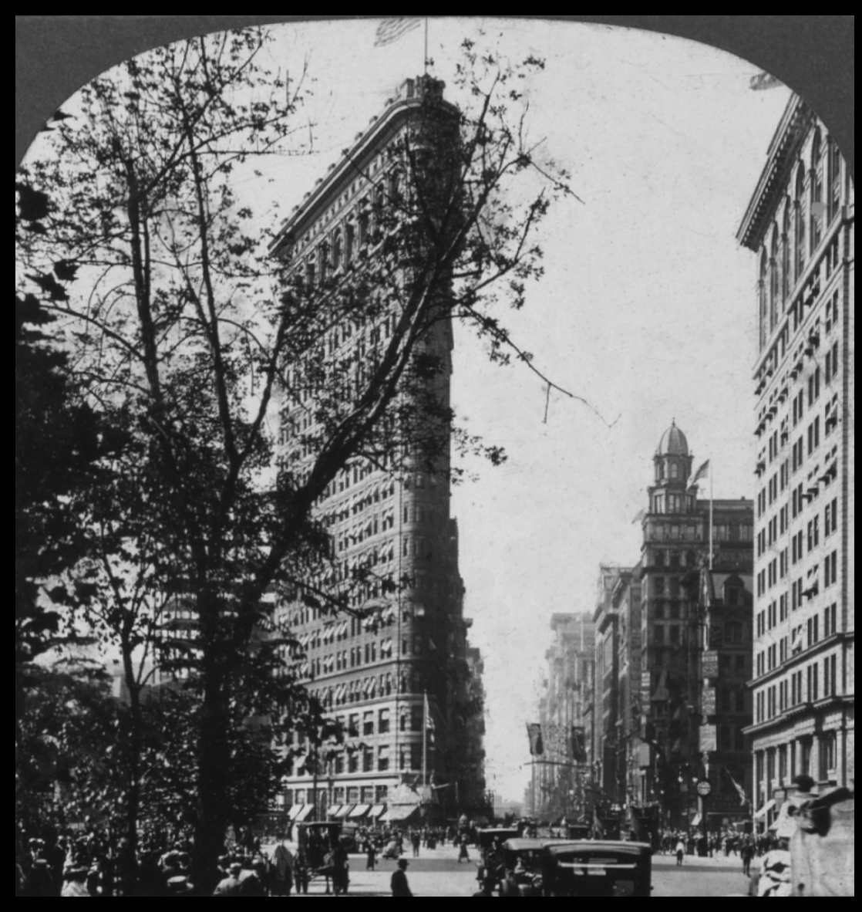
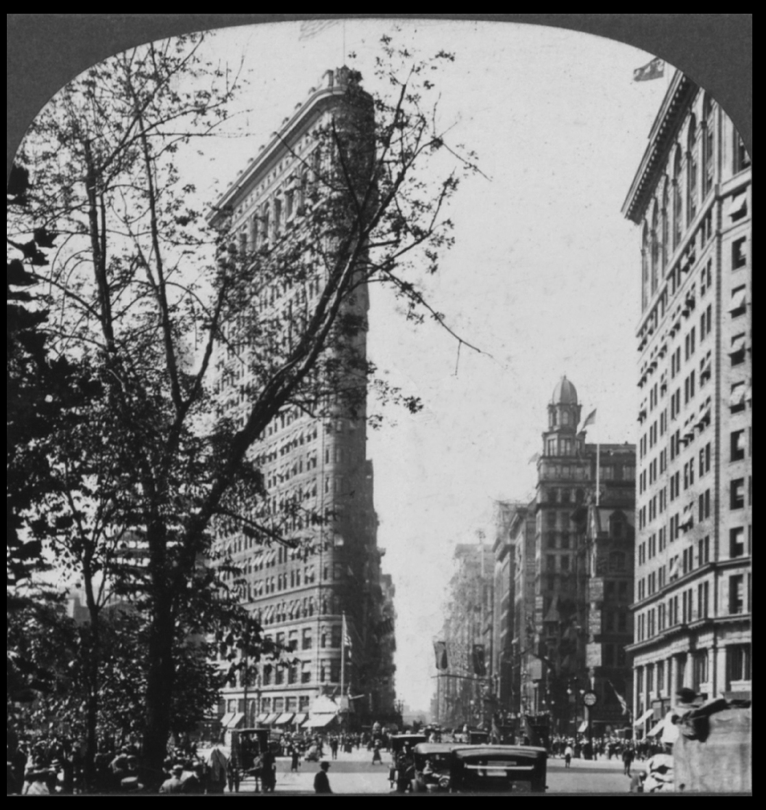
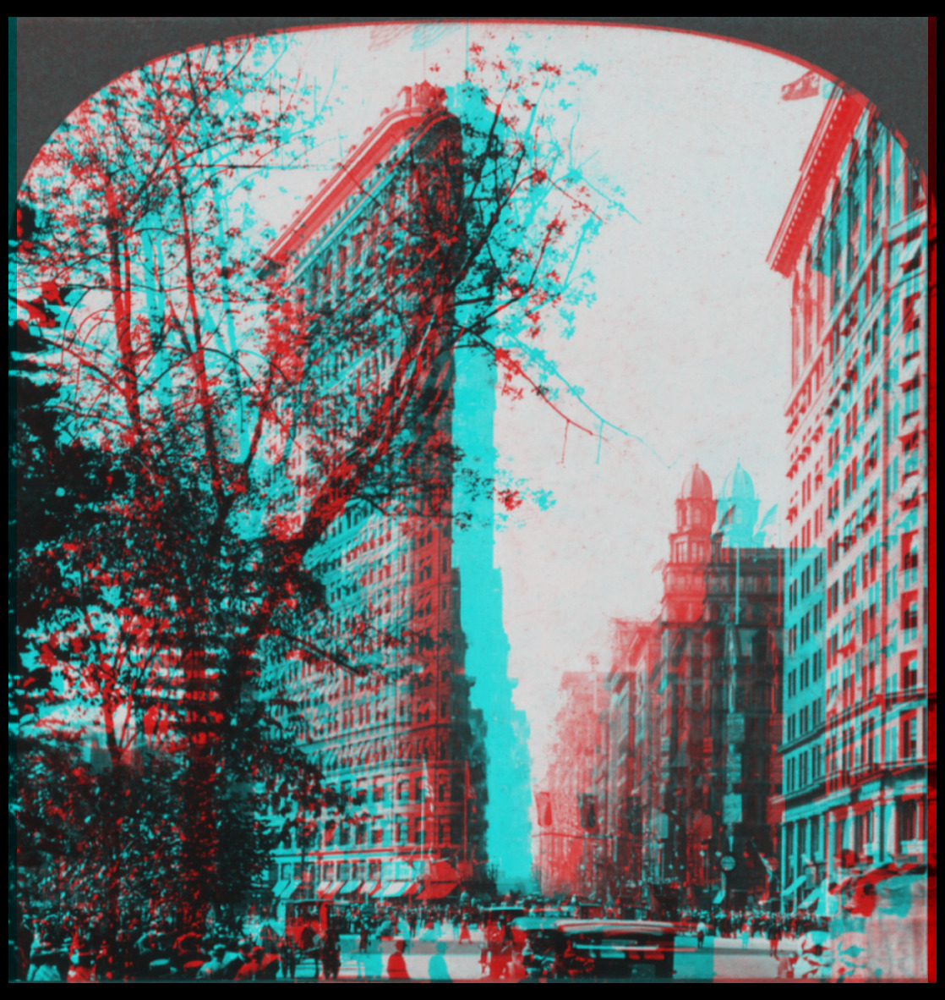

# anaglyph

Stereoscopic anaglyph encoder

## Preview

### Left Eye Image



[Image Citation](#image-citation)

### Right Eye Image



[Image Citation](#image-citation)

### Anaglyph Image



[Image Citation](#image-citation)

## Setup

### Installation

```./setup.sh```

### Format

```./format.sh```

### Build

```./build.sh```

### Execution

[Usage](#usage)

## Usage

### Interactive Shell Script

```./usage.sh```

### Low-level Executable

Syntax: ```./bin/anaglyph output_image image1=input_image_1 image2=input_image_2 filter1=<red_multiplier_1 green_multiplier_1 blue_multiplier_1> filter2=<red_multiplier_2 green_multiplier_2 blue_multiplier_2>```

Example: ```./bin/anaglyph anaglyph image1=image1 image2=image2 filter1=<1.0 0.0 0.0> filter2=<0.0 1.0 1.0>```

## Image Citation

[flatiron1.jpg](./flatiron1.jpg) and [flatiron2.jpg](./flatiron2.jpg)

Keystone View Company. The Flatiron Building, Fifth Avenue and Broadway, New York, N.Y., U.S.A. New York City New York, 1917. Meadville, Pa. ; New York, N.Y. ; Portland, Oregon ; London, Eng. ; Sydney, Aus.: Keystone View Company, Manufacturers and Publishers. Photograph. https://www.loc.gov/item/90710060/.
