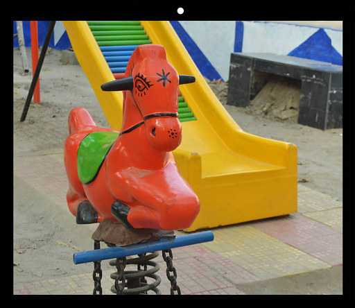
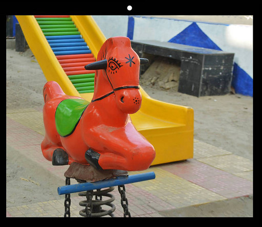
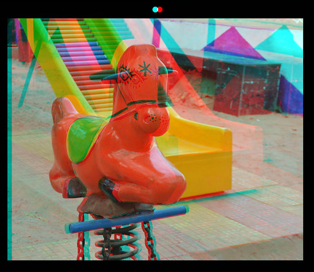

# anaglyph

Stereoscopic anaglyph encoder

## Preview

### Left Eye Image



### Right Eye Image



### Anaglyph Image



## Setup

### Installation

```./setup.sh```

### Format

```./format.sh```

### Build

```./build.sh```

### Execution

[Usage](#usage)

## Usage

### Interactive Shell Script

```./usage.sh```

### Low-level Executable

Syntax: ```./bin/anaglyph output_image image1=input_image_1 image2=input_image_2 filter1=<red_multiplier_1 green_multiplier_1 blue_multiplier_1> filter2=<red_multiplier_2 green_multiplier_2 blue_multiplier_2>```

Example: ```./bin/anaglyph anaglyph image1=image1 image2=image2 filter1=<1.0 0.0 0.0> filter2=<0.0 1.0 1.0>```
